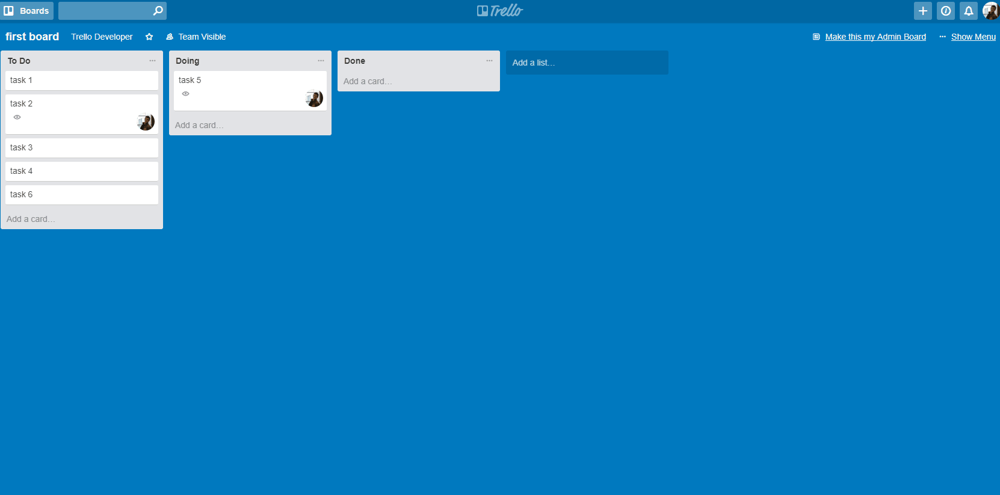
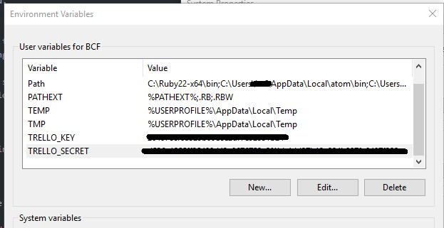
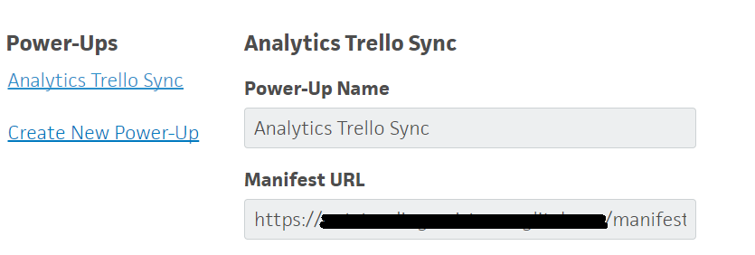
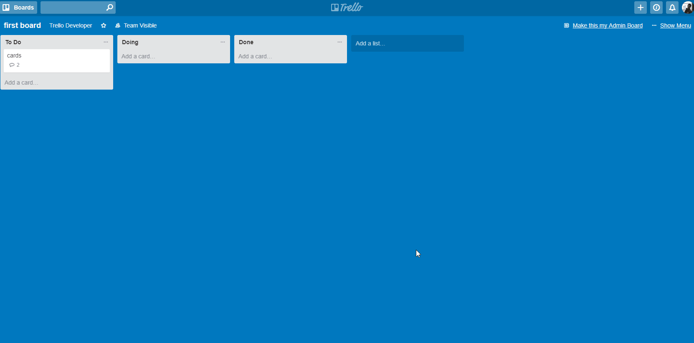
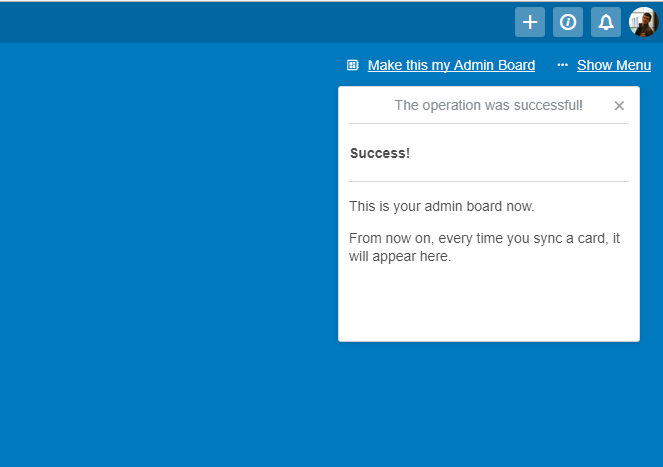

# The Trello Admin Board
This is a trello power-up that allows you to sync your cards into a specific board, called the admin board.

## Why this power-up?
We use Trello extensively in our team to keep track of our progress in several projects and to prioritize our work in the following weeks. All of our boards follow the same list structure to make things easier (backlog, to-do, in progress, etc.).

At some point, it became annoying as a user to have to navigate through the boards to check what has to be done each week. 'Wouldn't it be awesome if we could centralize a set of cards in one single board?', we asked ourselves. From this question, the Trello Admin Board project was born.

## What can this extension do?
* Synchronize the cards you want, so these are all centralized in an Admin Board.
* The synced cards reflect any changes done to the original:
    * Comments will be added/updated/deleted.
    * New lists are created in the Admin Board if needed when the original card is moved.
    * The synced card disappears once the original is deleted.



## Installing the Extension
The installation consists of 2 parts:
1. Setting up a web server that listens to the Webhooks sent by Trello and acts as middleware between the power-up and the Trello API.
2. Adding your Trello credentials as environment values.
3. Installing the Trello power-up in the boards you want to sync.
4. Last steps from the team page.

### Running the web server
The first requisite to run the extension is to run it in a machine accessible through port 443 (HTTPS). **We recommend importing this repository into a [Glitch](https://glitch.com/) project**, as it will take care of installing the dependencies and setting up the proxy to redirect the requests to the *node.js* server.

However, if you have a web server ready, you may use it to install the extension:
1. First go to the file *config/app.json* and change the value of the field *trello.urls.callback* to match your server address.
2. Then, install the Trello Admin Board by cloning this repository and installing the dependencies.
    ```
    npm install
    ```
3. And run your server using:
    ```
    npm start
    ```
4. You should see a message in your console saying that the server is up and running.

### Adding your Trello credentials
In order to authenticate against the Trello API, the server needs the Trello credentials of the team administrator; these can be found and generated [here](https://trello.com/app-key).

These values need to be stored as environment variables with **TRELLO_KEY** and **TRELLO_SECRET** as their respective keys in the machine where the server is running. The way of doing this depends on the operative system where you are running the solution.

Below you have a sample screenshot in a Windows environment.



### Installing the Trello power-up
The last step consists of telling Trello where to find the *power-up* and of installing it in the boards in which the extension is wanted:
* The team administrator needs to go the [Power-Ups Administration](https://trello.com/power-ups/admin/) and select the team where the power-up will be installed.
* Once in the Team page, click on *Create New Power-Up*.
* Fill in the required fields, which are Power-Up Name and the URL to the manifest.json. The latter is served by the web server in which the extension is running.


### Last steps from the team page
If you have done everything right, now you should be able to see the power-up listed under *power-ups* from the board menu. The first thing you have to do is enable it in every board where you'd like to use it.


Once the administrator has enabled the power-up in the boards where its needed, it is time for the users to give the power-up access to their credentials. This is done using the OAuth mechanism provided by the Trello API and it is triggered as shown below:


The last thing the user needs to do in order to start working with the extension is to select the board that will act as the Admin Board. This is done by clicking on the button that is found on the top right corner of the board (*Make this my Admin Board*).



## Contributing

1. Fork it!
2. Create your feature branch: `git checkout -b my-new-feature`
3. Commit your changes: `git commit -am 'Add some feature'`
4. Push to the branch: `git push origin my-new-feature`
5. Submit a pull request :D

## License
Released under the MIT license.
